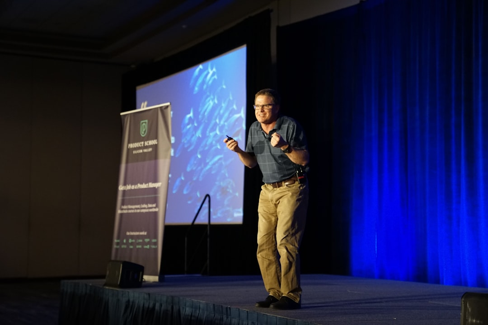

# How to Prepare for a Public Speaking Engagement
By Joe Belli | July 2025 | [**Link to LinkedIn Article**](https://www.linkedin.com/pulse/how-prepare-public-speaking-engagement-joe-belli-1isdc/?trackingId=c6LXZq75TBSngsmTofbZeA%3D%3D)

---

By following this guide, you'll be able to plan properly, no matter the surroundings and equipment avaailable to you. You'll be better to manage common anxieties and present with assurance.

## Table of Contents

- [**Chapter 1. Pre-Presentation Planning**](#chapter-1-pre-presentation-planning)
- [**Chapter 2. Structure Your Talk**](#chapter-2-structure-your-talk)
- [**Chapter 3. Creating Visual Aids**](#chapter-3-creating-visual-aids)
- [**Chapter 4. Rehearsing the Presentation**](#chapter-4-rehearsing-the-presentation)
- [**Chapter 5. Technical & Logistical Preparation**](#chapter-5-technical--logistical-preparation)
- [**Chapter 6. Day-Of Tips**](#chapter-6-day-of-tips)
- [**Chapter 7. Conclusion**](#chapter-7-conclusion)
- [**Optional Extras**](#optional-extras)
- [**Formatting Tips**](#formatting-tips)

---

## Chapter 1. Pre-Presentation Planning

Whether you're creating a new presentation from scratch, or working with existing material, planning is essential. While last minute interruptions do happen in the real world, it's best to prepare in advance whenever possible. Taking the time to think through your goals and audience can make a major difference in how your presentation is received.

Here are four important steps to guide your planning.

1. **What is the goal of your presentation?** Are you trying to inform, persuade, or inspire your audience? Defining your objective early will help you shape the tone, structure, and content of your presentation.

2. **Who is your audience?** Are they potential clients, team members, or experts in the field? Are they familiar with your topic, or is it new to them? Understanding your audience allows you to tailor your message to their needs and expectations.

3. **What is the focus of your topic?** Is your subject about a product, concept, or system? Would approaching it from a different angle (such as a use-case acenario or problem solution framing) help your audience better understand it? Reframing the topic can often make the material more engaging, and memorable.

4. **What are some key points your audience should remember?** When your presentation ends, what do you want your audience to take away? Identify those essential points early so you can emphasize them clearly throughout the presentation.

---

## Chapter 2. Structure Your Talk

Now that you've clarified your purpose and audience, it's time to organize your content and decide how your presentation should flow.

Here are three key elements to consider when structuring your talk.

1. **What is your presentation's overall structure?**  Like a delightful story, or article, an effective presentation has a clear beginning, middle, and end. Start with an introduction to set expectations. Use the body of the document to explain your main points in a logical order. End with a strong conclusion that reinforces your message and offers a clear takeaway.

2. **How will you present your information? Through text, visuals, or both?** Will you use slides with headings and bullet points? Full-screen visuals with narration? A combination of both? Tailor your approach to your audience. For example, a highly visual presentation may work better for a general audience, while technical details may require more structured text.

3. **How do you support your main points?** Include evidence that reinforces what you're saying. This could be images of your product in use, a pie chart of survey data, or direct quotes from customer testimonials. Supporting materials add credibility and help the audience retain what they've heard.

---

## Chapter 3. Creating Visual Aids

Now that you've structured your talk, it's time to consider how visuals can support your message. The tools and design choices you make will affect how clearly your audience understands and remembers your key points.

1. **What tool will you use to build your presentation?** Will you use PowerPoint, Google Slides, Keynote, or a simple image viewer if your presentation is all image-based? Choose the one you're most comfortable with and that best first the needs of your audience and content.

2. **How will you design your slides?** Aim for minimal text, large and readable fonts, and clean layouts. Slides should support your message, not compete with it. Avoid overcrowding them with too much information. 

2. **Are your visuals accessible?** Use high-contrast colors to improve readability and include alternative text for images if the slides will be shared digitally. These steps help make your presentation inclusive for all viewers.

## Chapter 4. Rehearsing the Presentation

To deliver an effective presentation, you'll need to practice, rehearse, and refine your content. Rehearsal helps reduce showtime anxiety, improve delivery, and ensure that the timing and structure of your presentation work in a live setting.

Here are three strategies to make your rehearsal time more effective.

1. **Practice repeatedly and seek feedback.** The more you rehearse your presentation, especially on your own, the more confident and comfortable you'll become. Repetition helps reduce stress and often commits key parts to memory. Once you're confident rehearsing alone, present it to a friend or colleaguea nd ask for feedback.

2. **Time your presentation.** If you're given a time limit, rehearse with a timer to see how your content fits within that window. Are some slides too long? Can others be shortened or removed? Could one dense slide be split into two? Adjust and rehearse again to see how those changes affect your timing and flow.

3. **Record and review yourself.** Once you're familiar with the content, try recording a full run-through. Watch the playback and evaluate from your audience's point of view. Are you speaking clearly? Do your visuals match your narration? Is the pacing natural and easy? Use your observations to make final adjustments.

---

## Chapter 5. Technical & Logistical Preparation
With your presentation rehearsed and refined, it's time to focus on the equipment, space, and resources that will support your presentation. Technical or logistical issues can distract from your message, so it's important to prepare ahead of time.

Here are two key areas to focus on.

1. **Check your presentation space and equipment.** If possible, visit the room where you'll be presenting. Does the room support your audience well? Do what you must do to ensure your audience's comfort as best as you can. With regards to equipment, you might want to run your presentation on that equipment to ensure that everything works properly. Make a note of any equipment that needs replacing, or any adjustments your should make to your presentation. 

2. **Prepare backups and supporting materials.** How will you access your presentation? Save your file in multiple places. A copy on a USB Flash Drive and a copy in the cloud as well. Make sure that you can log into any accounts you'll need. If you're preparing handouts, find out:
- Who will print them?
- Do the printouts need to be collated?
- How long will printing take?
- Do you know how many people need printouts?
- Will there be other print jobs ahead of yours?

The more details you handle in advance, the fewer surprises you'll face on the day. It's helpful to keep a running checklist of technical and logistical tasks. 

## Chapter 6. Day-of Tips

The big day has arrived. Your hard work has led to this moment, and now it's time to deliver a confident and engaging presentation.

Here are a few last minute tips to help you succeed.

1. **Do a physical warm-up.** Light-stretching or movement can help you feel more relaxed. Try a few jumping jacks, toe touches, or reach upwards to stretch out your spine. Stay loose, but don't over do it. You're just warming up, not working out. 

2. **Manage your nerves.** Feeling nervous is normal. To calm yourself, stand up straight and take a deep breath. Hold it in for five seconds, then exhale completely. Do this a few times. Doing this kind of breathing cal lower your heart rate and help you feel more in control.

3. **Connect with your audience.** Make eye contact while you speak. It shows confidence and helps your audience feel included. If you're nervous, try looking just above or between audience members' eyes, or look at their foreheads, it give the same effect without feeling intense.

4. **When things go wrong.** Sometimes, no matter how much preparation you do beforehand, things will still go wrong on the day of the presentation. You can't help it. But if it does, try to maintain your composure as much as you can. Sometimes, the audience is oblivious to the problem, and they'll remain oblivious to the problem if no one points it out. 

---

## Chapter 7. Conclusion

Preparing for a presentation takes time, practicce and thoughtful planning, but your effort will pay off. From understanding your audience to rehearsing your presentation, creating visuals, and preparing your space, you've done everything you can to ensure a confident and successful delivery.

Remember, public speaking is a skill, not a talent. The more that you prepare, the better you'll get. Trust your process, stay flexible, and most importantly, focus on sharing your message.

You've got this.

---

## Optional Extras

We covered a lot of information in the article above. The following is a list pf websites and articles to inspire you further.

- [**Toastmasters International**](https://www.toastmasters.org/) - Since 1924, Toastmasters has helped millions of people become more confident public speakers. Their clubs offer hands-on opportunities to practice communication and leadership in a supportive environment.

- [**TED Talks**](https://www.ted.com/talks) - Explore thousands of talks across every subject imaginable. TED speakers are often examples of delivering engaging presentations, structure, and storytelling.

- [**Why Storytelling Matters by Garr Reynolds YouTube Video**](https://www.youtube.com/watch?v=YbV3b-l1sZs) - Garr Reynolds, author of Presentation Zen, shows how clarity and simplicity are at the heart of impactful storytelling - on stage and on slides.

- [**Presentation Zen**](https://www.presentationzen.com/) - A deep dive into Garr Reynolds' philosophies and slide design and visual storytelling. His post, "10 (or more) Ways to Make Better Presentations" is a great place to start.

- [**OneSkill PowerPoint YouTube Channel**](https://www.youtube.com/@oneskill_ppt) - Tutorials and animation tips from a PowerPoint pro. Learn how to design clean, modern, and animated presentations that look professional and polished.

---

## Formatting Tips

- Use H2 Headings for major sections and H3 for subsections.
- Break actions into bullet points or numbered steps for clarity.
- Use bold or italics to highlight key terms and helpful tips.
- Choose a clean, easy-to-read font (eg. Arial, Calibri, or Verdana)
- Pair a bold heading font with a simple body font for contrast and clarity.

---

Thanks for reading my article. I hope this guide helps you walking into your next presentation with clarity and confidence.

[**Back to top**](#how-to-prepare-for-a-public-speaking-engagement)
